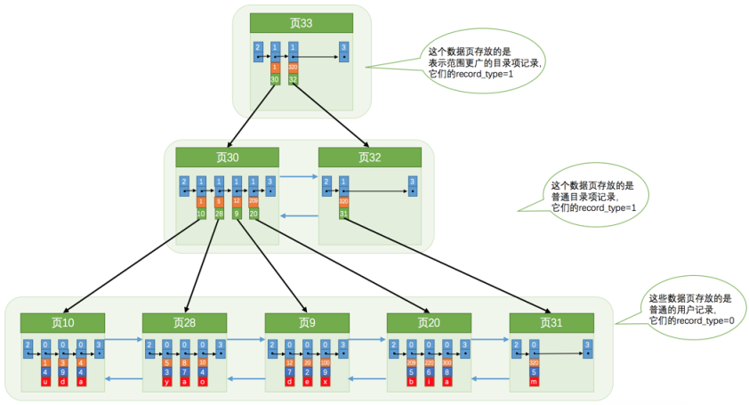

# 面试常见问题

## 慢查询

造成慢查询的原因有：
1. 聚合查询
2. 多表查询
3. 表数据量过大查询
4. 深度分页查询

可以开启慢查询日志来定位慢查询，需要在配置文件中配置
```
slow_query_log = 1
slow_query_log_file = /var/log/mysql/slow.log
long_query_time = 2 # 记录执⾏时间超过2秒的查询
```
这样，就会自动将耗时超过两秒的查询记录到日志文件中

## SQL 优化

EXPLAIN 能够查看一条 SQL 语句的执行计划，有一些比较重要的字段：
- possible_key：当前 SQL 可能用到的索引
- key：当前 SQL 实际命中的索引
- key_len：索引占用的大小
- Extra：额外信息
    - Using index：覆盖索引，无需回表
    - Using temporary：使用临时表
    - Using filesort：使用文件排序
- type：在表中找到所需行的方式，由上到下性能主键下降
    - system：表仅有一行，无需优化
    - const：根据主键或唯一二级索引找到一行
    - eq_ref：join 查询时，被驱动表是主键或唯一二级索引
    - ref：二级索引与常量的匹配
    - range：能使用索引的范围查询
    - index：全索引扫描，遍历整个索引，类似于全表扫描，性能比 all 稍好
    - all：全表扫描

可以通过这个执行计划，分析怎么造成的慢查询，再针对性解决。

SQL 优化可以针对
- 表的设计优化：使用合适的数据类型，适当冗余
- 索引优化
- SQL 语句优化：
    1. 尽可能指明具体查询的字段，尽量覆盖索引
    2. 避免造成索引失效的写法
    3. 用 union all 代替 union，因为 union 多一次过滤的操作，效率低
    4. 避免在 where 子句中对字段进行表达式操作
    5. 能用 inner join 就不用 left join、right join，优先把小表放外面，小表驱动大表
- 主从复制，读写分离
- 分库分表

## 索引

InnoDB 存储引擎使用的索引是 B+ 树索引。InnoDB 的数据存在**页**中，一个页能存好多条数据，每一页中的数据是按照主键大小排序的。

当一个页中的数据满了时，会进行**页分裂**，并保证下个页中的数据的主键大于上个页中的主键

InnoDB 默认会创建**聚簇索引**，也就是根据主键大小排序，且叶子节点存储完整的数据。索引由若干个索引项组成，每个索引项又包含两个字段：“数据所在的页”和“这个页中最小的主键值”。这些索引项如同数据一般被组织在一个个**页**中，同样满足单个页内递增，不同页间递增的原则。目录页太多的话，还会产生更高一级的目录页

::: tip 提示
如果没有主键，那么聚簇索引会依据唯一索引创建，如果也没有唯一索引，InnoDB 会生成一个隐藏列作为聚簇索引
:::

而对于非主键的列的查询，可以创建**二级索引**，与聚簇索引不同的是，二级索引的叶子节点存储的并不是完整的数据，而是**索引列 + 主键列**这两列的值。索引项存的也不是主键值 + 页号，而是**索引列值 + 主键值 + 页号**。当依据某个二级索引查找数据，但查找的数据不全在二级索引的叶子节点上，这时候就会进行**回表**，依据主键值去聚簇索引上查找数据

如果查询数据不需要回表，也就是数据都能够在这个索引中的叶子节点中获得，这就称为**覆盖索引**

如果对多个列建立二级索引，这就称为**联合索引**，联合索引以第一个列为基准排序，如果第一个列的值相同，则以下一个列的值为基准排序，以此类推

### 创建索引的原则

尽量在一下情况下创建索引
1. 为经常搜索、排序、分组的列创建索引
2. 列的基数（不重复的数据的个数）越大越适合创建索引
3. 索引列的数据类型尽量小，占用的空间尽量小
4. 对于字符很长的列只为前几个字符创建索引

### 索引失效的情况

1. 对索引列使用函数或表达式
2. 以通配符开头的模糊查询
3. 在使用联合索引时，没有以最左侧的索引列开始匹配（**左前缀原则**）
4. 使用 or 连接非索引列

### 索引下推

索引下推就是，能在索引中过滤的条件，在扫描索引时就顺便过滤了，只有满足条件的记录才会回表


## 锁

### 有哪几种锁

按加锁粒度，分为**表锁**和**行锁**。按加锁机制，分为**乐观锁**和**悲观锁**


### 行锁

行锁只锁定一行记录，允许其他事务访问表中其他行。行锁底层是通过给索引加锁实现的，这意味着只有通过索引访问数据时才会加行锁，否则退化为表锁


## redo log 和 undo log

mysql 修改数据是先把数据读取到内存中的缓冲区中，然后在缓冲区中进行修改，之后再在某个时刻同步到磁盘。而数据的同步磁盘操作是随机 io，性能较低。所以，在缓冲区中修改完数据之后，会同步到 redo log 的缓冲区中，之后同步到 redo log 文件中，由于 redo log 文件是顺序 io，性能较高。如果 mysql 宕机，恢复后可从 redo log 中恢复数据。

在 mysql 修改数据前，会将修改前的数据写到 undo log 中，用于之后恢复

## 事务

### 事务的特性

事务有四大特性，ACID：
- 原子性：事务是不可分割的最小操作单元，要么全部成功，要么全部失败
- 一致性：事务必须使数据库从一个一致性状态变换到另一个一致性状态
- 隔离性：并发下，多个事务同时执行，互不干扰
- 持久性：事务一旦提交或回滚，对数据的更改是永久的

### 事务的隔离级别

并发下，事务会出现**脏读**，**不可重复读**，**幻读**的问题，而不同的隔离级别能够解决不同的问题

- 脏读：一个事务读到另一个事务还没有提交的数据
- 不可重复读：一个事务先后读取同一条记录，但两次读取的数据不同（由于其他事务的修改），针对的是一条数据
- 幻读：在同一个事务中，两次执行相同的范围查询，第二次查询却看到了第一次没有看到的“新行”（由于其他事务的新增），就像产生了幻觉。，针对的是一个范围内的数据

隔离级别有一下几种：
1. 读未提交：三种问题都不能解决
2. 读已提交：可解决脏读问题
3. 可重复读（mysql 默认）：可解决脏读和不可重复读
4. 串行化：可解决三种问题

### MVCC

MVCC 是多版本并发控制，每次修改数据时，都会**⽣成⼀个新的版本**，⽽不是直接在原有数据上进⾏修改。并且每个事务只能看到在它开始之前已经提交的数据版本

MVCC 的实现，依赖于**隐藏字段**，**undo log 日志**和 **readView**

每张表都有两个字段：
- DB_TRX_ID：最近修改的事务的 id
- DB_ROLL_PTR：指向 undo log 中的这条记录的上一个版本。同一条记录的多个版本就由 DB_ROLL_PTR 连接起来，形成了**版本链**

readView 解决的是，不同的事务隔离级别下，版本链中哪个版本是可见的。InnoDB 为每个事务都会创建一个 readView，有四个核心字段：
- creator_trx_id：创建该 ReadView 的事务 ID
- m_ids：所有活跃事务的 ID 列表，活跃事务是指那些已经开始但尚未提交的事
- min_trx_id：所有活跃事务中最⼩的事务 ID
- max_trx_id ：事务 ID 的最⼤值加⼀。换句话说，它是下⼀个将要⽣成的事务 ID

可见性规则：
- 如果某条记录的 DB_TRX_ID < min_trx_id，说明 DB_TRX_ID 这个事务已提交，就可以读到这条数据
- 如果某条记录的 DB_TRX_ID = creator_trx_id，说明就是当前事务修改的，可以读到
- 如果某条记录的 DB_TRX_ID > max_trx_id，说明 DB_TRX_ID 这个事务在当前事务开启后才开启，不可读。
- 如果某条记录的 DB_TRX_ID 在 min_trx_id 和 max_trx_id 之间，若其不在 m_ids 列表中，说明其已提交，可以读，否则不能读

不同隔离级别下，生成 readView 的时机不同


## 主从复制

主节点负责写，从节点负责读，这就需要主从之间进行同步。主要分为三步
1. 事务提交时，主节点会将变更的数据记录（写命令）到二进制文件 binlog 中。
2. 从节点读取主节点的 binlog，写入到自己的 relay log 中
3. 从节点会实时监控 relay log 的变更，并执行其中的内容


## 分库分表

单表太大时，查询、备份、DDL 都会变慢；单库并发太高时，CPU、IO、连接数都会成为瓶颈

分库分为两种：
1. 垂直分库，按照不同的模块，将不同的表拆分到不同的库中
2. 水平分库，按照一定策略，将同一张表中的数据拆分到多个库中。

分表也有两种：
1. 垂直拆分，将一张表不常用的数据或大数据单独放到另一张表中
2. 水平拆分，将一张表的数据拆分到多张表中

分库分表会带来一些问题：
1. 分布式事务
2. 跨库 join
3. 全局唯一 id
4. 路由问题等等
